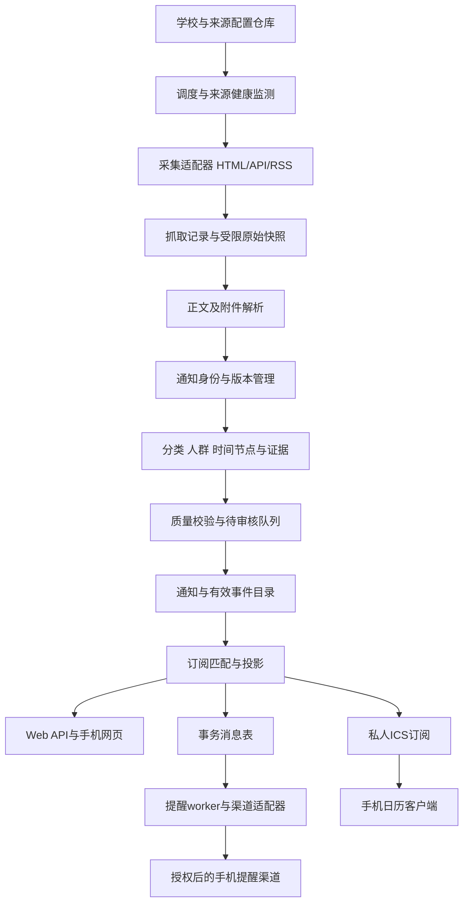

# CampusPulse 系统架构 v0.2

设计日期：2026-10-01。状态：设计稿；接口、任务和适配器尚未实现。当前编码方向以 [C++桌面实施路线](cpp-implementation-roadmap.md)为准：本地桌面先行，移动App与公共后台后置。本文API/worker/PostgreSQL等部署内容描述未来服务模式；通知、证据、订阅与版本规则仍适用于桌面核心。

## 1. 产品契约

输入是各高校公开官网的通知、公开结构化接口和附件。输出是可筛选信息流、带原文依据的事件节点、持续更新的 ICS 日历与可选提醒。六个主题为 `exam / competition / scholarship / campus_activity / academic_affairs / career`。

默认用户路径：选择学校 → 选择主题 → 设置学生身份及可选学院/年级 → 查看命中预览 → 生成私人日历链接 → 在手机订阅 → 设置提醒。学院和年级是可选过滤项，系统不需要身份证、学号或成绩。

通知可被多主题命中；一条通知可以没有事件，也可以产生多个事件。发布日期只用于信息流排序，不能充当报名或考试日期。没有可确定时间的通知仍可订阅和收藏，等待后续安排或人工补充。

## 2. 部署与组件

先采用模块化单体：一套代码、一套数据库，API 和 worker 分进程，避免每个学校部署一个服务。多个 worker 可水平扩展；Redis/外部队列只在数据库任务领取成为瓶颈时增加。

建议目录：`apps/api`、`apps/web`、`workers`、`core`、`adapters`、`configs/schools`、`schemas`、`tests/fixtures`、`docs`。当前只交付 docs/configs/README。

模块职责：

| 模块 | 输入 → 输出 | 边界 |
|---|---|---|
| Registry | 版本化配置 → 生效来源 | 校验域名、字段、适配器版本；拒绝任意脚本 |
| Scheduler | 到期来源 → 采集任务 | 每来源租约、同域限流、退避、失败可见 |
| Adapter | 列表/详情 → 标准文档 | 不包含个人订阅逻辑 |
| Parser | HTML/附件 → 文本与定位 | 记录页码/单元格；不能把空正文判成成功 |
| Processor | 文档 → 通知版本和候选节点 | 保留依据、冲突、提取器版本 |
| Review | 候选节点 → 可订阅事件 | 明确规则确认或人工审核；不靠 AI 自报置信度发布 |
| Matcher | 通知/事件 + 订阅 → 可见集 | 通知流与日历使用不同门槛 |
| Calendar | 事件投影 → ICS | 稳定 UID、变化序列、取消和过期窗口 |
| Delivery | 到期消息 → 渠道结果 | 幂等、重试、死信；不把服务端发送当手机已看到 |

## 3. 全国高校接入契约

三层复用：学校配置描述学校身份和来源；CMS/站点适配器描述抓取方式；分类和订阅模型独立于学校。

标准适配器接口：`discover(cursor) -> entries, next_cursor`、`fetch(entry) -> RawDocument`、`parse(raw, config_revision) -> ParsedNotice`。ParsedNotice 包含 source_item_key、canonical_url、title、body、published_at、publisher、attachment_refs、field_evidence 和 diagnostics。游标只有在本页处理成功后提交。

优先适配公开 RSS、静态 HTML 和公开 JSON API；确有页面渲染需要才增加浏览器适配器。登录系统不纳入默认来源，不能将认证失败绕过为公开采集。

配置文件包含：schema_version、学校稳定 ID、名称和地区、时区、允许域名、来源 ID、栏目入口、适配器 ID/版本、分页方式、列表与详情选择器、附件规则、主题候选提示、抓取周期、来源健康阈值。来源主题仅作提示，正文判断具有更高优先级。

行政编码可选且记录编码体系与版本，不猜测学校代码；学校改名或域名变更不改变内部 UUID。学校内的学院/部门使用稳定 unit_id 和别名。

仅靠 CSS 配置不能覆盖全部官网。共用 CMS 使用适配器模板；特殊分页或公开接口新增适配器。社区配置提交需通过 schema、离线样本解析、日期与分页样本测试，再做低频在线冒烟检查；学校包可以独立标记 draft/verified/degraded/disabled。

当前JSON契约仍使用0.1-draft版本，已有六份东电HTML/CSS来源配置可由C++桌面适配器运行，学工支持有限分页；就业动态接口尚未启用。其他未验证来源保持`enabled=false`，具体范围以学校包和验收记录为准。

## 4. 采集、版本和去重

1. 每来源周期建议初始 60 分钟并加随机抖动；同域初始并发 1、请求间隔至少 3 秒，实际依站点响应和来源策略调整。使用条件请求；遇到 429/503 按响应与退避策略暂停。
2. 列表增量采集需回看最近页和置顶页，定期重扫可配置历史窗口。首次回填设历史标记，默认不轰炸用户推送；用户可主动选择历史事件。
3. URL 规范化只能去除明确追踪参数；就业详情的 `id` 等身份参数必须保留。优先以来源原文 ID 为身份，否则用规范 URL。内容哈希决定版本，不能当唯一文章身份。
4. 保留原始内容哈希与语义哈希；访问量、页脚和下载次数变化不触发通知更新。附件字节变化也可触发重新解析。
5. 同一原文出现在多栏目，建立 source_occurrence；跨站转载用关联记录。相似标题只产生重复候选，不能自动合并有不同学院截止时间的通知。
6. 发现更正/延期通知时保留独立通知及其 `amends` 关系。审核后修订对应事件，不覆写原始证据。
7. 某页消失或短暂 404 只标记不可访问；只有明确撤销证据或审核决定才能取消事件。解析异常、连续空列表及 DOM 结构变化进入告警，不能表现成“最近没有通知”。

网站数据进入提取器时仅作数据，不能触发工具、命令或配置变更。公开部署的来源 URL、重定向和附件必须验证允许域、DNS 解析与网络地址，禁止访问内网、回环和云元数据地址；下载有类型、大小、耗时上限。原始快照私有保存且有保留期，公开信息流默认提供摘要与原文链接，名单附件只链接、不汇总个人记录。

## 5. 时间与适用人群

事件节点包括 registration_open、registration_deadline、payment_open、payment_deadline、submission_deadline、exam_session、competition_session、activity_session、interview_session、public_notice_window。

一个竞赛公告的报名截止与比赛时间产生两个独立事件；公示截止不得标成奖学金申请截止。报名链接、材料要求、主办单位、地点与适用人群是独立字段。

每个关键字段保存依据及审核状态。时间质量分为 exact_datetime、date_only、relative_resolved、ambiguous、missing。明确年月日时分可进入自动规则校验；只有日期的事项保持 DATE，不虚构 23:59；缺少年份、多个年份冲突、工作日推算或只有“另行通知”时先审核。相对日期必须记录锚点及推算规则。

角色至少分 student/teacher/staff；学历、学院、专业、入学年、毕业年单独建维度。院系上报截止属于 department 角色，不自动冒充学生提交期限。某来源的默认受众不覆盖正文的明确人群。

`unknown` 是有意义的状态。严格过滤时未知不匹配；默认通知流可显示并提示“适用范围待核实”，日历自动纳入则要求 verified 时间且适用范围匹配，或用户明确选择未知范围。来源所属学校、主办学校与活动举办学校分开；转载外校活动不得自动标记为本校活动。

AI 可辅助分类、摘要和候选提取，保存模型/提示版本与输入哈希；正文截取和输出结构需校验。提取失败仍保留通知流，并进入待审核，不伪造日期补齐字段。

## 6. 订阅系统

订阅支持单校、多校、学校内部门以及个人主题集合。订阅由多个 filter_group 组成：组间 OR，组内维度 AND；一个维度的多个值为 OR，空维度表示不限制。排除项优先于包含项。

例：`东北电力大学 AND {exam,competition} AND student` 或 `另一学校 AND career AND 2027届`。学校和主题必须绑定在同一组中，避免多校配置交叉扩大订阅范围。

通知流匹配：school/source + categories + notice_stage + audience + keyword 条件；日历在此基础上筛选 event_kind、review_state、时间窗口与事件受众。语义匹配结果返回 matched_reasons，用户能看到“为何推荐”。关键词只做可选辅助，不替代主题。

支持 all/any/exclude 关键词，以及 source_scope/host_scope 的学校过滤模式。默认学校匹配指来源学校；是否只看本校现场活动另设选项。多订阅命中同一个事件时日历合并，提醒按用户、事件、渠道、时间去重，并保留命中订阅关系。

订阅设置版本化，变更生效后重算匹配与未来提醒；取消订阅撤销未发送任务。已推送消息不可回收。收藏和“手动加入日历”作为用户显式覆盖，不篡改公共事件数据。

## 7. 手机日历与提醒

第一层提供 `https://<部署域名>/calendars/<随机令牌>.ics`；可额外提供 webcal 链接。一次性导入 .ics 与持续订阅是两种行为，界面应分别说明。[iCalendar 标准](https://www.rfc-editor.org/rfc/rfc5545)规定事件交换格式；[Apple 官方说明](https://support.apple.com/en-euro/guide/iphone/iph3d1110d4/ios)支持 iPhone 订阅外部 ICS 日历；[Google 官方说明](https://support.google.com/calendar/answer/37100)提供电脑网页端 From URL 接入路径，随后需验证账号在手机端同步。

每个事件使用稳定 `UID=<event_uuid>@<实例域名>`；每 feed 对用户可见内容变化维护单调 SEQUENCE，LAST-MODIFIED 记录实际变更，DTSTAMP 不随每次请求无意义改变。标题含节点类型，DESCRIPTION 含摘要、截止精度、适用范围和原文 URL。定时事件用 UTC 输出或完整 VTIMEZONE；日期事件用 DTSTART;VALUE=DATE，跨日 DTEND 为不包含的结束日。

日期型截止输出当天全天“截止日期，具体时刻未说明”，不生成未经证实的精确截止瞬间。服务端日期提醒锚点可由用户设置为当日 09:00，明确这是提醒时间，不是官方截止时间。

更新不更换 UID；已订阅事件取消或因筛选变更移出时，在对应 feed 保留取消投影与历史 DTSTART，SEQUENCE 递增。取消墓碑初始保留 90 天，实际依客户端测试调整；已过期事件在窗口外正常清理。客户端对取消和移出的行为可能不同，必须实测，不能仅以 ICS 输出认定手机已清除。

VALARM 可表达提醒偏好，但客户端是否保留和触发需测试。订阅抓取频率由客户端控制，服务端不能保证临近截止更正即时同步。建议第二层添加服务端提醒：先一种国内可用、用户授权的推送渠道，再考虑 Web Push 和更多渠道；接入后仍记录提供方接受状态，只有渠道提供证据才记设备接收。

默认建议截止前 3 天、1 天、2 小时；活动前 1 天、1 小时。无精确时刻的节点按用户提醒锚点计算。延期取消旧未来任务并重建；已经过去的触发不补发密集消息，必要时发送一条变更提醒。安静时段默认推迟普通消息；若推迟会越过截止则遵循用户明确选定的“提前到安静时段前/跳过/允许紧急提醒”策略。

私人日历使用高熵令牌，数据库仅存哈希，原始令牌只在创建/轮换时显示；泄露可撤销轮换。客户端不便附带登录凭证，令牌即读权限。令牌不得进访问日志、分析系统或公共缓存；feed 使用 private/no-store 策略和请求频率限制，返回 ETag。私人用户资料只用于匹配，不写入公开通知或事件。

手机验收至少覆盖 iPhone 日历、Google Calendar、一个用户实际使用的安卓日历，分别记录接入、更新时间、取消、日期事项、时区和闹钟；不支持订阅的客户端提供单项导入与推送路径，但导入后没有自动更新保证。

## 8. API 与可靠性

接口契约草案：

| 接口 | 用途 |
|---|---|
| GET /v1/schools | 学校、覆盖状态和最后成功采集 |
| GET /v1/schools/{id}/sources | 来源及健康状态 |
| GET /v1/notices | 游标分页、主题/阶段/受众过滤 |
| GET /v1/notices/{id} | 当前内容、版本及证据 |
| GET /v1/events | 已审核事件和日期精度 |
| POST /v1/subscription-previews | 不保存设置的命中预览 |
| POST/PATCH /v1/subscriptions | 创建或修改本人订阅 |
| POST /v1/calendar-feeds | 创建 feed 并返回一次性令牌 |
| POST /v1/calendar-feeds/{id}/rotate | 撤销旧令牌并轮换 |
| GET /calendars/{token}.ics | 无登录但持令牌可读的日历 |
| POST /v1/reviews | 维护者提交审核决定 |

变更与 outbox 在同一数据库事务提交；任务按租约领取，进程崩溃可重新领取。发布重复采集任务不得产生重复版本或事件。提醒发送前检查最新事件、订阅版本和渠道状态；使用唯一幂等键，渠道支持时传给提供方。不支持幂等且发送超时的任务标记 unknown 并对账，不盲目重复发送。

用户 API 校验归属，审核与来源编辑有独立权限。公开事件仅查询 approved 状态；取消记录由日历投影专门处理。监测 last_success_at、数据滞后、解析缺字段、待审核年龄、来源失败、消息延迟与失败。全国规模预算依据实际学校数、来源数、周期和每轮详情量估算，不承诺未知吞吐。

## 9. 实施与验收

| 阶段 | 产出 | 完成判据 |
|---|---|---|
| 0 当前 | 通用平台、模型、大学包契约、模板与校验 | 文档和示例契约一致，来源证据明确 |
| 1 | 共享 HTML 适配器 + 社区样本检查框架 | 固定样本与低频实采成功；大学包贡献有可复现验证，重复采集幂等、解析失败可见 |
| 2 | Case/ActionStep/UserTask、时间证据、审核、ICS | 一事多通知、多步骤、日期型截止、延期/取消均正确，ICS 可解析 |
| 3 | 双端个人待办与手机接入 | 真实手机订阅、状态同步、更新及通知验证，有记录 |
| 4 | 多学校、多类站点结构 + 一个推送渠道 | 新校复用核心和前端，主题覆盖、未知范围和外校转载过滤可解释 |
| 5 | 社区试运行与公开开源发布准备 | 外部贡献者按指南完成新增学校；配置贡献 CI 和维护升级流程成功 |

关键回归：教师四六级考务通知不进学生考试日历；奖学金公示不冒充申请；院系截止不冒充学生截止；空日期不入日历；相同标题不同学院不误合并；跨年相对日期待审核；旧页消失不等于取消；转载外校招聘会地点正确；时间更正 UID 不变且未来任务重排；worker 崩溃与发送超时不造成无依据重复发送。

日期与人群质量评估使用人工标注样本，按来源和主题记录数量、误报、漏报、冲突与校验结果。开发中用这些结果决定自动发布门槛，不能以任意置信度常数声称准确率。
