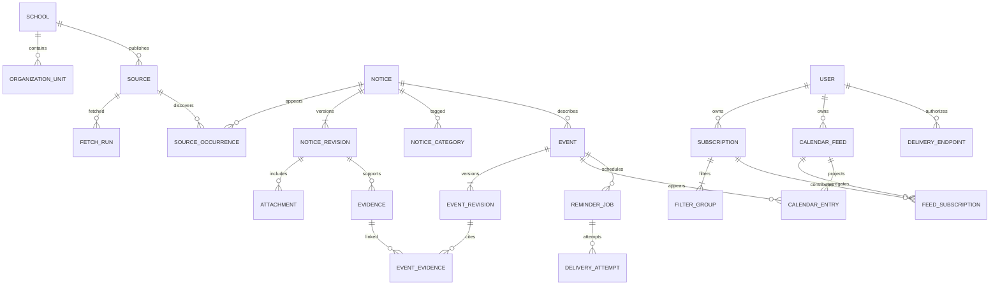

# CampusPulse 数据模型 v0.2

这是逻辑模型及实现约束，不是已运行的数据库迁移。v0.2加入校园事项与个人任务，v0.3加入包注册。当前C++桌面路线使用SQLite：稳定UUID身份、UTC时间值、独立纯日期及受校验JSON文本；下文timestamptz/date/JSONB等是未来PostgreSQL服务端映射描述。核心逻辑不依赖这些数据库特有类型，迁移随实际功能分步建立。

## 1. 实体关系

## 2. 来源与通知

| 实体 | 核心字段与约束 |
|---|---|
| school | id、slug UNIQUE、name、aliases、country、province、city、timezone、optional_codes；slug 不随改名自动改变 |
| organization_unit | id、school_id FK、parent_id FK、name、type、aliases；父子必须同学校 |
| source | id、school_id、unit_id、source_key、entry_url、allowed_hosts、adapter_id、config_revision、enabled、status、last_success_at；UNIQUE(school_id,source_key) |
| source_config_revision | id、source_id、revision_number、config_json、hash、validation_state、created_at；配置不可变历史 |
| fetch_run | id、source_id、config_revision_id、cursor_before/after、started_at、finished_at、status、HTTP/解析统计、error；失败不推进游标 |
| raw_document | id、source_id、fetch_run_id、url、fetched_at、status_code、etag、last_modified、bytes_hash、private_storage_ref、retention_until；不公开原始名单 |
| notice | id、school_id、current_revision_id、lifecycle_state、first_seen_at、last_seen_at；school_id 表示主来源学校，不证明举办学校 |
| source_occurrence | id、source_id、notice_id、source_item_key、canonical_url、first_seen_at、last_seen_at；UNIQUE(source_id,source_item_key)，无原文 ID 时 key 基于保留身份参数的规范 URL |
| notice_revision | id、notice_id、revision_number、raw_document_id、title、body_text、summary、publisher、published_at、published_precision、semantic_hash、extractor_version、stage、created_at；UNIQUE(notice_id,revision_number)，只在语义变化时新增 |
| attachment | id、notice_revision_id、original_url、name、mime_type、content_hash、parse_state、private_storage_ref；解析状态含 pending/succeeded/failed/skipped |
| evidence | id、notice_revision_id、attachment_id NULL、field_path、quote、locator_json、extraction_method、extractor_version；locator 为 HTML selector/字符区间、PDF 页码、表格单元格等 |
| notice_category | notice_id、notice_revision_id、category、method、review_state；一篇多类，分类历史绑定 revision，当前查询只读当前版本 |
| notice_relation | from_notice_id、to_notice_id、relation_type、review_state、evidence_id；类型 duplicate_of/reprints/amends/cancels，禁止自关联 |

stage 为 application/registration/schedule/result/public_notice/policy/general，可以用关联标签支持多阶段；v0.1 若单列无法表达混合通知，以 general 配合事件节点和证据，不能将公示归作申请。

source_occurrence 的跨站合并必须有明确转载依据或审核；合并保留旧 notice_id 的重定向。已有事件 UUID 与历史 feed UID 不可直接换掉，以免用户出现两份事项。

## 3. 事件、适用范围与证据

| 实体 | 核心字段与约束 |
|---|---|
| event | id、notice_id、stable_node_key、current_revision_id、created_at；UNIQUE(notice_id,stable_node_key)，节点身份与标题、日期无关 |
| event_revision | id、event_id、revision_number、notice_revision_id、kind、title、time_precision、starts_at/ends_at、start_date/end_date_exclusive、timezone、location、host_school_id NULL、organizer_text、status、review_state、change_reason、created_at |
| event_evidence | event_revision_id、evidence_id、field_path；覆盖时间、人群、地点等字段 |
| audience_rule | id、notice_revision_id NULL、event_revision_id NULL、state、group_json；必须恰好一个目标，事件规则优先于通知默认值 |
| review_decision | id、target_type/id、decision、reviewer_id、reason、created_at；审核证据可追溯，变更结论产生新版本 |

stable_node_key 由系统首次建立并持久化，例如报名截止节点分配一个不可变键；不得用 `deadline_2026-10-20` 作身份。新版本提取先与已有节点按类型、原文上下文和来源关系匹配；歧义交给审核，不能每次重跑生成 UUID。多场宣讲/考试同类型也须分别保留节点。

event.status：active/postponed/cancelled。review_state：candidate/needs_review/approved/rejected。通知不可访问是来源状态，不自动改变 event.status。

时间互斥约束：

- exact_datetime / relative_resolved：starts_at 非空、start_date 为空；若存在 ends_at 必须晚于 starts_at。relative_resolved 另存解析锚点与规则证据。
- date_only：start_date 非空、starts_at 为空；若存在 end_date_exclusive 必须晚于 start_date。公示 5月14日至17日的结束日为 5月18日；含末日的原始表述保留在证据。
- ambiguous / missing：不得进入已审核的日历投影；raw 时间表达在 evidence 中保存。
- 单个截止节点无需虚构结束时间。取消版本保留此前已知时间，feed 更新需要引用它。
- 所有 candidate 可以保留字段不完整状态；approved 必须满足时间、依据、人群策略和校验条件。

受众 group_json 用 OR 组、AND 维度表达：roles、education_levels、unit_ids、majors、admission_years、graduation_years。必须区分 any 与 unknown：any 是明确不限，unknown 是资料缺失。学生提交、指导教师提交和学院上报可在同通知生成不同角色的节点。

时间字段、人群字段、地点字段的质量分别记录，不用一个整体 confidence 掩盖“日期可靠但适用学院未知”。提取器数值置信度仅作排序提示，不作为自动审核凭证。

## 4. 用户、订阅与日历

| 实体 | 核心字段与约束 |
|---|---|
| user | id、auth_subject、timezone、created_at；匿名公共浏览不建账号，保存私人订阅需管理凭证 |
| subscription | id、user_id、name、enabled、settings_revision、calendar_policy_json、reminder_policy_json、created_at、updated_at |
| filter_group | id、subscription_id、school_ids、source_ids、categories、case_types、notice_stages、audience_filter、keywords、event_kinds、school_scope；同组 AND，组间 OR；case_types 为空表示所有，未建立 Case 的通知在此维度视为 unknown |
| subscription_revision | id、subscription_id、revision_number、settings_json、effective_at；重算使用同一个确定版本 |
| subscription_match | subscription_id、notice_id、event_id NULL、evaluated_revision、matched_reasons、state；通知匹配与事件匹配用分别的唯一索引，避免 NULL 唯一性漏洞 |
| calendar_feed | id、user_id、name、token_hash UNIQUE、status、created_at、revoked_at；不保存明文令牌 |
| feed_subscription | feed_id、subscription_id；复合主键，二者所有者必须相同 |
| calendar_entry | feed_id、event_id、uid、sequence、projection_hash、projection_json、last_modified_at、state、removed_at；UNIQUE(feed_id,event_id)、UNIQUE(feed_id,uid) |
| user_event_override | user_id、event_id、action、created_at；action include/exclude；仅改变个人投影，不改变官方事件 |

过滤字段可先用受校验 JSONB/数组实现；学校与来源引用需要服务端验证存在性及相互归属，后续可拆关系表。订阅只包含 ID 引用，不接受用户提交任意抓取 URL。categories 必须属于六个固定值。

CalendarEntry 保存用户当时实际获得的字段，用于生成取消墓碑和单调序列；重新筛选时不能只实时查当前匹配集合，否则无法可靠通知客户端移除旧事项。相同用户多个订阅命中一个事件时，每 feed 只生成一个投影；不同 feed 可以使用同一稳定事件 UID。

## 5. 消息与幂等

| 实体 | 核心字段与约束 |
|---|---|
| delivery_endpoint | id、user_id、channel、encrypted_credentials_ref、enabled、verification_state、verified_at；未验证不发真实消息 |
| outbox_message | id、aggregate_type/id、revision、message_type、payload、created_at、available_at、status；业务修改同事务写入 |
| reminder_job | id、user_id、event_id、event_revision_id、endpoint_id、trigger_key、scheduled_at、dedupe_key UNIQUE、state、lease_until、attempt_count；同一接收目标、事件版本和触发只排一次 |
| reminder_job_subscription | job_id、subscription_id、subscription_revision；多命中订阅共享 job，至少一个仍生效才继续 |
| delivery_attempt | id、job_id、attempt_number、started_at、finished_at、provider_message_id、outcome、error；UNIQUE(job_id,attempt_number) |

job.state 为 queued/leased/sent/failed/unknown/cancelled。sent 表示提供方接受；device_received/read 仅在渠道有回执时另记。ICS 客户端刷新和系统闹钟不属于 reminder_job 可观察结果。

推荐 dedupe_key 为用户、事件、事件版本、endpoint、实际触发时刻和消息类型的稳定摘要。不同订阅在相同时刻相同渠道合并；不同偏好触发时刻默认分别保留，可设置最大提醒次数。事件修改时撤销旧版本未发送任务，在发送前再次核对 latest revision；租约和校验无法消除已经进行中的外部发送，需提供方幂等/对账与变更提醒处理竞态。

## 6. 索引和事务规则

- notices(school_id,last_seen_at)、notice_revisions(notice_id,revision_number)、全文索引(title/body)、类别与审核状态索引。
- events(notice_id,stable_node_key)、已审核事件的 starts_at 和 start_date 分别建立范围查询索引，避免强制转换日期精度。
- source_occurrences(source_id,source_item_key)、raw_document(bytes_hash)、attachments(content_hash) 用于去重与定位；哈希不能替代来源身份。
- reminder_job(state,scheduled_at)、fetch_run(source_id,started_at)、outbox_message(status,available_at) 支持任务领取。
- current_revision_id 必须引用同 notice/event 的 revision，使用复合外键或同事务严格校验；跨学校单位、feed/订阅所有者同样校验。
- 修改事件版本、current_revision、取消旧任务、写 outbox 必须同一事务。采集、解析和外部发送在事务外运行，避免长锁。

## 7. 说明性案例

以下是虚构字段示例，仅说明模型，不能作为东电实际通知发布：一则“某竞赛报名安排”有学生报名截止 2026-10-20 17:00、作品提交截止 2026-11-02（未写时刻）、比赛时间另行通知。

模型产生两个 candidate：registration_deadline/exact_datetime 与 submission_deadline/date_only；比赛仅保存 missing 候选或时间待定说明，审核后前两个才可入日历。第二则延期通知关联 amends，把报名截止改到 10月22日 17:00：原 notice/revision 保留；报名事件 ID 不变，新增事件 revision，日历 sequence 增加，撤销旧提醒并重排。作品提交节点不因报名变化重建。

真实来源的奖学金公示包含一个公示区间及名单附件；建 scholarship + public_notice_window，附件保持链接，不能推断申请开始或申请截止。来源核查见 [neepu-sources.md](neepu-sources.md)。

## 8. 双端校园办事扩展

| 实体 | 核心字段与约束 |
|---|---|
| workflow_template | id、key、version、case_type、school_id NULL、step_definitions、validation_state；通用模板不代表官方要求 |
| campus_case | id、school_id、case_type、academic_term、batch_key、scope_json、title、status、version；学期/批次不明时先独立候选，不误合并 |
| case_notice | case_id、notice_id、relation、review_state、evidence_id；多篇通知构成一个事项 |
| action_step | id、case_id、stable_step_key、current_revision_id；UNIQUE(case_id,stable_step_key)，日期变化不换步骤身份 |
| action_step_revision | id、step_id、version、action_type、required_state、audience_rule、instruction、official_entry_url、materials_json、consequence_text、review_state；关键要求和后果有证据，不能推断丧失资格 |
| action_step_evidence | step_revision_id、evidence_id、field_path；时间、入口、材料、必选性、后果分别依据 |
| step_dependency | step_id、prerequisite_step_id、dependency_type、evidence_id NULL；禁止循环且同一 case，官方依赖必须有依据 |
| step_event | step_id、event_id、relation；relation open/deadline/session/window；一步可有开始与截止两个时间节点 |
| user_case | id、user_id、case_id、tracking_mode、status、version、joined_at；UNIQUE(user_id,case_id)，不存官方报名资格 |
| user_task | id、user_case_id、step_id、status、completed_at NULL、snooze_until NULL、version、last_seen_step_revision_id；UNIQUE(user_case_id,step_id)，外键必须同 case |
| user_task_activity | id、task_id、actor_user_id、client_mutation_id、operation、previous_version、new_version、server_time；UNIQUE(actor_user_id,client_mutation_id) |

步骤 revision 与对应 EventRevision 的时间证据保持一致。ActionStep 指行动，Event 指日历时间；不要在两个表各存一个会独立漂移的截止时间。没有明确日期的步骤照样显示在个人计划，但不生成期限闹钟。

新增事件类型 payment_open/payment_deadline，用于明确缴费区间；付款入口和缴费完成均不由日历事件直接表示。事件所属通知保持可追溯，case/step 通过关系表把多通知组合。

user_task.status：not_started/in_progress/user_reported_done/dismissed/cancelled。逾期由有效截止与当前时间派生，不覆盖用户原状态；blocked 同样由官方依赖派生。dismissed 为用户决定不追踪，不显示成已完成。已读单独记录，不改变上述状态。

任务提醒扩展 reminder_job 增加 user_task_id FK、step_revision_id 与 reminder_mode（informational/task_followup）。informational 为主题或事件订阅提醒；task_followup 在发送前必须核对任务未完成且未暂停。两种路径相同时刻命中同一用户/事件/渠道时合并发送，保存各自原因，不能复制两条催缴消息。

个人任务完成后保留日历时间背景，可在个人 feed 的标题或描述更新为“我已完成”；关闭剩余个人催办。客户日历已有 VALARM 无法由后台即时回收，个人状态与 ICS 投影变化仍需等待客户端同步，这一点必须进入真实手机验收。

跨端使用服务端 version 和 mutation 幂等键。完成状态写入、任务操作日志、取消未发送提醒和 outbox 同事务提交；后续通知增添新步骤时创建新的任务，不重置已有任务。办理要求实质变化建立复核步骤，原完成记录保留。

## 9. 社区大学包注册与覆盖

| 实体 | 核心字段与约束 |
|---|---|
| university_package | id、school_id、package_key UNIQUE、maintainer_refs、acceptance_state；包身份独立于运行实例 |
| package_release | id、package_id、pack_version、schema_version、core_compatibility、adapter_requirements、asset_manifest、content_hash、published_at；UNIQUE(package_id,pack_version)，已发布内容不可原地修改 |
| package_validation | id、release_id、validation_type、runner_version、result、evidence_ref、checked_at；区分 schema/fixture/live_smoke，不能单个passed代表全部通过 |
| instance_package_installation | instance_id、package_id、active_release_id、previous_release_id、activated_at；复合主键；原子升级并保存回退引用 |
| source_health_observation | id、source_id、fetch_run_id、observed_at、state、lag_seconds、diagnostics；运行健康独立于发布接纳状态 |
| school_category_coverage | school_id、category、scope_json、source_ids、coverage_state、evaluated_at；学校有某主题source不等于全校该主题完整覆盖 |

维护者引用只公开自愿提供的社区账号，不需要私人联系方式。包维护权限不能自动授予查看user_task或delivery_endpoint权限。软件schema_version、大学包pack_version、适配器接口adapter_version分别验证，不通过修改包版本绕过核心兼容限制。具体发布与导入工具尚未实现。
