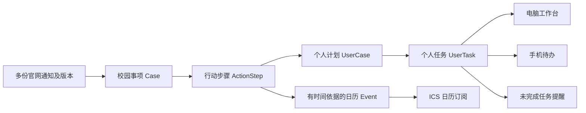

# CampusPulse 双端与校园办事框架 v0.2

2026-10-01：当前用户方向为先C++电脑软件、后移动App；此前Web/PWA和同步立即实现方案已调整。本文保留通用办事模型及未来同步契约，第2节按当前形态更新；后续手机/同步/API验收是未来阶段，非桌面首版前提。编码顺序见 [C++桌面实施路线](cpp-implementation-roadmap.md)。

## 1. 从漏缴费这个问题定义产品

核心对象是“需要学生完成的事情”。官网通知提供依据；待办告诉学生行动；日历告诉学生时间；提醒帮助学生记住；个人完成记录帮助停止重复催办和检查遗漏。

东北电力大学[2024—2025学年第一学期重修缴费通知](https://jwc.neepu.edu.cn/info/1014/5548.htm)分别说明缴费区间、缴费入口和最终有效名单依据；[考试重修栏目](https://jwc.neepu.edu.cn/kszx.htm)另有有效名单、课表。由此设计独立的缴费步骤、后续核对步骤和跨通知办事链。这些是历史设计样本，不是当前缴费安排。

首版优先事项：

| 事项类型 | 可配置步骤示例 | 需要避免的遗漏 |
|---|---|---|
| 重修 | 查看要求、报名、缴费、核对有效名单、查看课表 | 报名后漏缴费；看过公告却未办事 |
| 补考 | 查看适用规则、确认是否需报名、查看考试安排、参加考试 | 不同学校补考是否需报名不同；不能强加缴费步骤 |
| 奖助学金申请 | 查看条件、准备材料、提交申请、补交材料、查看公示 | 院系截止早于校级截止；公示与申请阶段混淆 |
| 通用申请 | 检查要求、准备材料、提交、补充、查询结果 | 只收集发布日，漏提取学生实际提交期限 |

上表是可选模板，不是全国高校统一规定。学校包依据真实通知选择步骤、责任角色和依赖；缺失日期显示“待发布/待核实”，不自动生成期限。用户不提供成绩时，系统不能自动判定其必须重修或符合奖学金资格；通过个人关注和“加入我的计划”表达需求。

## 2. 双端怎样构造

一套共享领域模型和明确应用操作；桌面首版本地运行与存储，未来移动通过服务端接口接入。学校差异进入来源与流程配置，客户端不写学校专用分支。

第一版实现可安装C++ + Qt桌面软件；Widgets仅作建议功能原型，视觉样稿后定。移动App技术栈和连通方式尚未确定，预留稳定ID、版本、序列化数据和应用接口。首版ICS文件导出不等于手机持续订阅；后者需要常驻可访问服务。

| 功能 | 电脑 Web 端 | 手机端 |
|---|---|---|
| 首页 | 待办概览、时间线、通知列表 | 今天/即将截止/仍未完成的事项 |
| 查看通知 | 原文、附件、依据、办事步骤并排 | 关键操作、日期、官方入口，展开原文 |
| 订阅设置 | 学校、学院、主题、流程偏好 | 快速开关与同一套完整设置 |
| 我的计划 | 多步骤进度、按学校/学期筛选 | 下一步行动、标记完成、稍后提醒 |
| 日历 | 月/周视图和订阅管理 | 日历接入、今日事项和提醒设置 |
| 跨端同步 | 修改订阅、个人待办和完成记录 | 查看并修改相同记录 |

这些是主要使用方式，不限制能力。用户在手机也能订阅，在电脑也能标记完成。维护者审核工作台是同一系统的独立角色视图，不把学校管理员参与作为产品启动前提。

## 3. 公共流程与个人待办分开

Case 是一次具体办事，例如“某校某学期重修”，把报名通知、缴费通知、课表通知和更正关联起来。ActionStep 是公开要求，例如“完成缴费”。UserCase 是学生主动加入的个人计划。UserTask 是这个学生的缴费完成状态。同一公开步骤可以对应很多学生的任务，各自互不影响。

不同学期、课程组和申请批次不合并；关联多篇通知要保存学校、学期、批次、事项类型和审核依据。不能只靠“重修”标题将所有通知串在一起。

关注分两层：主题订阅帮助发现；加入个人计划表示需要追踪办理。默认订阅不会自动为每位学生创建每个奖学金申请任务。用户可另选“自动跟踪此类事项”，并预览匹配范围；自动创建仍不意味着资格已被学校确认。

## 4. 漏缴费场景的闭环

1. 学生关注“重修”并加入相应学期计划；系统不需要拿到他的教务登录密码。
2. 系统识别报名与缴费是不同步骤，缴费通知出现后显示“还需完成缴费”，展示原文区间及官方入口。
3. 有明确截止日期的缴费步骤进入日历；未完成任务按个人策略排提醒。日期没有时刻时显示“具体截止时刻未说明”。
4. 手机提醒打开该任务页，用户可查看官方办理方式、标记“我已缴费”、暂缓个人提醒；暂缓不改变官方截止日期。
5. 完成操作同步到电脑端，停止这一步剩余的个人催办；核对有效名单仍是另一项任务。
6. 后续更正更新原步骤和事件；已经标记完成时，日期变化不清除完成记录。若办理要求发生实质改变，追加“核实是否需要补办”的待办，保留旧状态。

“已读”只表示看过；“我已完成”是用户自报；“已核对结果”是用户自报核查。首版不将这些显示成学校系统已确认；只有未来有明确授权且返回结果的官方对接，才能增加独立的官方核验状态。

## 5. 页面与共享接口

首版六个学生页面：工作台、通知中心、事项详情、我的待办、日历、订阅与提醒设置。事项详情为关键页面：需要做什么、谁需要做、截止时间、入口、材料、原文和剩余步骤同时可见。

维护者页面：来源健康、待核实字段、流程关联审核。规则校验可直接批准高确定性字段；不确定的缴费入口、时间、人群和跨通知关联必须能在这里纠正。

新增共享 API：

| 接口 | 用途 |
|---|---|
| GET /v1/cases | 查校园事项，支持学校/类型/学期/阶段 |
| GET /v1/cases/{id} | 关联通知、步骤、依据、变化记录 |
| POST /v1/my/cases | 加入个人计划；幂等避免重复加入 |
| GET /v1/my/tasks | 下一步、即将截止、待核实和已过期任务 |
| PATCH /v1/my/tasks/{id} | 标记状态、撤销自报、修改个人提醒；要求 expected_version |
| GET /v1/my/changes?cursor=... | 两端增量拉取变化，包含撤销/删除标记 |
| POST /v1/my/reminder-tests | 用户主动发一次测试提醒，检查接入状态 |

公共模板不能保存个人状态；所有 `/my` 接口验证归属。办理入口是原文跳转，首版不代报名或代缴费。

## 6. 同步与提醒不能只靠日历

服务器是个人状态的唯一权威，客户端本地只作缓存。状态修改使用 version/ETag 乐观锁；两端冲突返回 409 和最新值，不静默覆盖。请求带 client_mutation_id，离线重放不会生成重复记录。服务端记录操作时间与 actor，增量游标由服务端生成，不依赖手机时钟。

首版在线提交操作，断网时缓存可读并提示内容最后更新时间；恢复网络再刷新。离线标记完成与复杂冲突合并可后置，避免未同步的完成记录造成用户误以为服务端已停止提醒。

ICS 负责时间展示与客户端日历闹钟，不能把手机日历中的“删除事件”当作 CampusPulse 的任务完成。个人催办由服务端基于 UserTask 状态决定；支持一个明确授权的推送渠道并实际测试。电脑通知与手机推送共享消息记录，可显示失败、未确认送达等状态。

建议高影响未完成事项采用“新通知出现 + 临近截止 + 要求变更”的可配置提醒，不无限催促。静默时间、频次上限、关闭渠道和每事项暂缓都由用户控制。若用户发现通知时期限已过，显示已过期与官方咨询入口，不伪造补办路径或承诺一定能补办。

## 7. 通用配置的四层

| 配置层 | 描述什么 | 复用方式 |
|---|---|---|
| 学校来源包 | 去哪里抓、如何解析、哪些单位 | 每校配置，复用站点适配器 |
| 校园流程包 | 该事项有哪些步骤、人群、依赖、材料 | 通用模板 + 有依据的学校覆盖 |
| 用户订阅 | 关心学校、事项、主题和范围 | 两端共享，不写入公共学校包 |
| 提醒偏好 | 渠道、提前量、安静时段、频次 | 个人默认 + 每任务覆盖 |

流程类型新增 retake、makeup_exam、scholarship_application、general_application；这是主题下的办事分类，不能用它替换原先六类主题。补考可能叫重考，学校别名映射需依据当地规则，不能全国强行当同义词。

步骤类型包括 inspect_requirements、register、pay、prepare_materials、submit、supplement、verify_result、view_schedule、attend。步骤标注 required/optional/unknown，依赖标注 official_requirement/advisory；只有明确依据才能变成不可跳过的官方前置条件。

## 8. 首版开发边界与验收

先开发桌面通知、订阅、待办和实际本地提醒，再以多学校/多业务验证通用性。移动App、云同步及持续手机提醒后置，不作为桌面首版完成条件。

当前顺序以C++桌面实施路线为准；本节后续双端同步及手机验收保留到移动阶段。社区模板、包验证和通用数据模型从桌面首版演进，避免以后为了新学校修改界面逻辑。

验收门槛：

- 重修报名完成后，缴费任务仍为未完成；缴费标记完成后停止其未来催办，但不自动完成有效名单核对。
- 电脑操作后手机刷新看到相同状态；手机操作后电脑同步；并发修改产生可见冲突，不丢失修改。
- 只有通知发布日期时不生成缴费截止；只有截止日期时不猜具体时刻。
- 所有期限及官方入口可追溯到原文；缴费二维码只跳转官方附件，不由模型重构付款码。
- 补考配置可以没有报名或缴费；奖学金公示不创建申请任务。
- 取消、延期、后补材料通知保留历史并正确更新相关任务；已有个人完成不因重新采集被抹掉。
- 至少一个真实手机收到测试提醒、完成任务同步、日历订阅更新成功，分别保存证据；服务端发送日志不能替代手机收到证明。

当前完成到框架与配置草案；以上是下一阶段验收契约，不是已经通过的运行结果。
