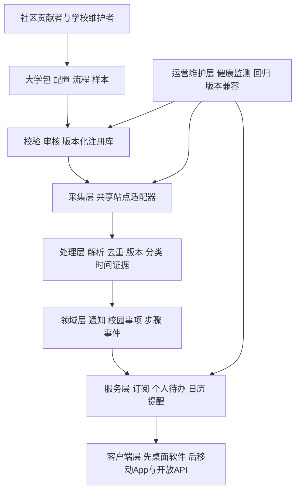

# CampusPulse 开源通用平台框架 v0.3

日期：2026-10-01。当前方向：全国高校通用开源版本，由社区添加和维护大学；先做C++ + Qt电脑软件，移动App后续接入。本文描述跨部署形态的通用平台；具体编码顺序以 [C++桌面实施路线](cpp-implementation-roadmap.md)为准。东北电力大学仅是参考学校包，重修漏缴费是需求起点，不能决定核心只服务某校或某一业务。

## 1. 项目定义与成功条件

CampusPulse 是把高校异构公开通知转换为统一信息流、校园事项、个人待办、日历与提醒的开放平台。学校名称、域名、栏目、学期称呼、流程要求都属于大学包；核心系统提供统一能力。

关键通用性判据：增加一个使用已支持站点结构的大学，只添加学校配置、适用流程与样本，不改核心、数据库或前端；增加新的站点结构时只新增/扩展共享适配器，不复制整个系统。跨校用户可以在一个账号订阅多个学校。

全国高校覆盖是社区持续建立的注册库，不等于首版采集全国全部学校。每个学校展示来源覆盖和最后成功采集；未知覆盖不能宣称完整。

## 2. 六层架构



| 层 | 通用职责 | 学校差异入口 |
|---|---|---|
| 注册与扩展 | 包身份、版本、兼容性、贡献审核 | 学校定义、来源配置、流程映射和样本 |
| 采集 | 调度、请求、分页、限流、抓取记录 | URL、选择器、CMS参数、允许域名 |
| 信息处理 | 正文/附件解析、去重、更新、分类、时间证据 | 名称别名、栏目提示、可声明的解析参数 |
| 领域模型 | Notice/Case/ActionStep/Event 与证据历史 | 依据本次通知实例化校内办理流程 |
| 个人服务 | Subscription/UserTask/CalendarFeed/Delivery | 学校引用和个人偏好；不写学校专属业务分支 |
| 客户端 | 通知、事项、待办、日历、设置、维护者界面 | 校名、可选单位、覆盖状态、步骤由统一应用层提供 |

## 3. 三种资产、两种权限边界

核心程序包含统一模型、API、订阅、待办和客户端。共享适配器包含 HTML/CMS、RSS、公开 JSON API 等站点处理能力。大学包包含学校身份、官网来源、适配器参数、流程引用和测试样本。

大学包是受 schema 校验的数据，不能包含可自动执行的任意 Python、shell、远程依赖或模板表达式。特殊站点需要代码时，贡献到共享适配器模块，经过单独代码审查后随核心版本发布。公开实例不在运行中自动执行新 PR 的插件。

项目分为两种角色权限：学生管理自己的订阅、待办和提醒；维护者管理来源、样本与公开字段审核。学校无需先成为平台管理员才能被社区接入；维护者不因此拥有读取学生私人任务的权限。

## 4. 大学包契约

当前配置源布局保持 `configs/schools/<学校key>.json`。从单仓库开始，后期学校包数量和发布频率需要时再拆独立 Registry；包格式与核心边界先确定，不要求现在搭建包商店。

规划中的完整包由以下资产组成：

```text
学校包
├── manifest             包身份、发布版本、兼容范围、资产清单
├── school config        学校、单位、公开来源、抓取参数
├── workflow overrides   通用流程引用及有依据的学校差异
├── fixture manifest     样本URL、日期、哈希、清理说明
├── fixtures             列表/详情/附件的脱敏离线样本
├── expected outputs     预期通知、日期、人群与步骤
└── maintenance metadata 维护者、来源覆盖、最后复核与弃用说明
```

当前已落地学校配置/schema、检查脚本、贡献指南、通用模板以及C++桌面HTML/CSS原型和东电固定样本；完整manifest/fixtures通用契约与包发布工具仍待实现。schema_version表示配置格式；pack_version表示包内容；adapter_version表示代码接口，不能混用。

学校key 由注册库分配并保持稳定，不能根据现任学校名称重新生成。迁移域名或校名只改别名和来源；合并/拆分学校需明确身份迁移方案，保留已有用户订阅引用。

来源必须明确栏目和入口，不用整个子域作为无限递归爬取范围。一个栏目为一个 source，可以逐步接入；学校包可先覆盖教务，不要求六类主题都上线。

## 5. 适配器 SDK 契约

核心调用统一接口：discover(cursor)、fetch(entry)、parse(raw,config)。输出 ParsedNotice，要求来源身份、原文URL、正文、发布日期精度、附件引用、证据与诊断。插件接口将有 api_version、capabilities、config_schema 和 fixture_test_contract。

已有适配器处理不了的页面，应先判断能否新增通用能力。例如分页新形式可成为参数；特殊公开接口可新增公开API适配器。学校包不能借“特殊规则”重新实现个人订阅或日历逻辑。

附件解析器也复用 PDF/Word/Excel/OCR 处理链，返回页码/单元格等定位。没有可靠结果时保留链接及失败状态，不能用空结果冒充无通知。

## 6. 领域模型与扩展原则

| 模型 | 意义 | 扩展规则 |
|---|---|---|
| School/Unit/Source | 学校、单位、信息源 | 引用注册库身份 |
| Notice/Revision/Evidence | 原通知、历史版本、字段依据 | 原始事实与提取判断分开 |
| Case/ActionStep | 一次办事和操作步骤 | 多通知组合，流程可配置 |
| Event/Revision | 可订阅的时间节点 | 独立日期精度、稳定身份、更新与取消 |
| Subscription | 用户想看什么 | 多校 OR 组、组内 AND，不交叉扩大范围 |
| UserCase/UserTask | 用户要办什么、做到了哪一步 | 私人状态与公共要求分离 |
| CalendarFeed/Entry | 用户日历投影 | 稳定 UID、变化序列与撤销历史 |
| ReminderJob/Attempt | 提醒计划与渠道结果 | 版本校验、幂等、失败可见 |
| PackageRelease/Validation | 学校包版本和验收 | 离线校验、在线健康和发布状态分开 |

六个稳定主题为 exam/competition/scholarship/campus_activity/academic_affairs/career。重修、补考和申请是主题下的 case_type；可新增行业务类型而不改六类订阅含义。社区别名经注册映射到稳定类型；新增公共标准类型需要核心审查。暂未支持的细类可记录 namespaced tags，不允许任意字符串悄悄替换标准类型。

学校流程包能选择步骤、声明适用人群与规则，但官方要求必须引用通知/政策依据及有效期。学年和学期字段记录学校原始标签及可选标准映射，避免所有学校被强制分为同一种学期制度。没有证据的通用流程只作候选模板，不自动实例化成官方任务。

## 7. 社区维护生命周期

贡献路径：选择未覆盖学校/失效来源 → 复制模板 → 填写官方来源和共享适配器 → 添加脱敏离线样本及预期结果 → 本地检查 → PR → 自动校验和维护者审阅 → 受控在线检查 → 大学包发布 → 实例按锁定版本导入。

分三种独立状态：

- 校验与接纳：draft/validated/published/deprecated，描述包是否可发布。
- 来源健康：unknown/healthy/degraded/unreachable/disabled，描述当前采集运行结果。
- 主题覆盖：supported/partial/not_configured，描述某主题实际接入范围。

配置 schema 的 `status` 是早期静态来源集合状态，不能单独当作以上三项的实时证明。平台必须从校验记录与抓取记录生成状态。

配置通过本地检查只能证明字段契约有效；样本成功证明该样本解析；在线检查证明当时读取；持续健康需要运行记录。发布学校包也不等于大学全部通知覆盖。

维护职责：核心维护者负责公共契约与适配器；学校维护者负责该校包、样本和官方来源变动；学生反馈标题、原文URL、错误字段等最小证据，不能要求上传含个人名单的完整数据。

失效处理：连续异常显示数据滞后 → 创建可复现的问题报告 → 有维护者修复则更新样本回归 → 无维护者则标记 needs-maintainer → 必要时暂停单个来源，保留学校及订阅身份。来源暂停不自动取消已知考试；重大日期变更仍以原文依据为准。

社区 CI 主要离线运行，PR 不拿生产密钥，不通过带权限的工作流执行未经审查的贡献代码；在线核查与发布独立运行。该边界参考 [GitHub 官方安全文档](https://docs.github.com/en/actions/reference/security/secure-use)。

## 8. 双端、订阅与输出

桌面首版通过本地应用层取得学校覆盖、单位选项、事项与步骤；移动与服务端阶段再将这些操作映射为共享API，不写neepu/jlu等客户端分支。稳定身份、版本和序列化数据结构先保留，云同步方式后续决定。

订阅分发现与跟踪：通知流可关注学校/主题/人群，加入个人计划才生成需完成的步骤；用户可显式选择自动跟踪。公开校级信息不能证明某学生资格，未知人群和未知日期要可见。

输出统一经过订阅和投影层：桌面软件、未来移动App、ICS、RSS/JSON Feed、开放只读API及授权提醒渠道。首版ICS为文件导出；持续订阅需要稳定可访问的服务。移动、RSS/JSON Feed和第三方接口尚未实现，私人状态不混入公开Feed。

重修、奖学金、竞赛等都复用通用步骤模型；不同学校“报名后缴费”“无需报名”“线下提交”等差异来自学校包与原文。稳定事件更新和用户任务完成使用已有 v0.2 模型，不因提高平台抽象程度而丢失漏缴费需求。

## 9. 开源与部署

当前单仓库C++模块化桌面原型使用SQLite；src/domain、application、adapters、storage、desktop及configs、schemas、tests/fixtures已创建。公共服务和移动同步后置，原型未实现服务端API或常驻worker。

计划提供两种部署方式：个人/社团自部署，只启用所需大学包；公共实例，启用经校验包并维护共享来源。学校配置内容与用户运行状态分离，同一学校只采一次数据，再服务所有订阅者。

GitHub Actions 适合配置与样本CI、发布，批量公开数据生成可作为简化演示。双端私人任务和定时催办的生产运行需稳定后台、持久存储与调度，不能只依赖静态网站和构建产物。规模增长按域名限流、任务队列分配、事件索引及投影缓存渐进扩展，避免先承诺未知并发和全国全量覆盖。

代码与原创配置拟采用 MIT；正式发布前补齐 LICENSE 与贡献许可说明。学校内容、附件和第三方依赖不因代码开源而转为 MIT。公开托管、仓库创建和对外发布尚未执行。

## 10. 平台开发顺序与验收

| 阶段 | 目标 | 验收 |
|---|---|---|
| 通用契约 | 学校配置、适配器、领域模型、贡献规范 | 模板和参考配置可校验；核心无学校分支 |
| 参考实现 | C++桌面骨架、共享HTML适配器、本地存储与应用接口 | 使用受控样本验证版本、日期与任务状态 |
| 通用性验证 | 多个学校包、至少两种不同站点结构 | 新校只改包或共享适配器，核心和前端不复制 |
| 桌面学生闭环 | 订阅、个人待办、ICS导出和桌面提醒 | 实际窗口、保存和通知验证，完成和已读分开 |
| 后续移动接入 | 移动App、持续日历服务和同步接口 | 真双端同步及手机验证，不将本地导出当持续订阅 |
| 社区试运行 | 一次由其他贡献者完成的新增学校流程 | 按指南完成 PR、样本检查和修复，不靠作者手工改核心 |
| 持续维护 | 覆盖目录、失效反馈、包升级/回滚、稳定发布 | 用户能辨识覆盖与滞后，实例可锁定和回退包版本 |

东北电力大学可提供参考样本，但选定第二、第三校前需要明确真实来源与站点结构。本次不创建未经验证的新校配置来冒充通用性测试成功。
